<!--
THESIS: Una bitácora de productos reales; rechaza el perfil que se describe con adjetivos y barras decorativas.
OWN-WORLD: Azul-negro, blanco, cyan de señal y reglas finas; un diagrama animado abre bloques editoriales y evidencia textual.
STORY: Leonard se presenta, demuestra cuatro proyectos y conduce al visitante a su portafolio.
FIRST VIEWPORT: Un plano técnico animado ocupa el ancho y leonardsf.dev queda como acción dominante antes del registro.
FORM: Bitácora de ingeniería, cuarta dirección del conjunto, seed 5f8d8487.
FINISH: unreviewed and undocumented is unfinished; this build ends with the finish review, the verdict, and DESIGN.md
-->

  <picture>
    <source media="(max-width: 600px)" srcset="./assets/leonard-build-log-mobile.svg">
    
  </picture>
  
<a href="https://leonardsf.dev/"><strong>Explorar proyectos y servicios → leonardsf.dev</strong></a>

  
<a href="https://github.com/LeonardSF?tab=repositories">Repositorios</a> &nbsp;·&nbsp; <a href="https://t.me/LeonardSF">Telegram</a>

---

## Registro de proyectos

### [MI SAES 2.0 ↗](https://chromewebstore.google.com/detail/mi-saes-20/hflcfnffkbdeeneoffpnbalnefhgdbig)

**Una extensión de Chrome para estudiantes del IPN.** Añade al SAES una forma más clara de consultar materias, revisar ocupabilidad y preparar horarios sin sacar la información del navegador.

`JavaScript` `Chrome Extension` `Manifest V3`

### [Mi Horario ESIME ↗](https://mihorarioesime.com)

**Un organizador de horarios pensado para la comunidad de ESIME.** Permite reunir materias y visualizar la semana académica sin armarla manualmente.

`Desarrollo web` `Diseño responsive` `Producto educativo`

### Bot de citas por WhatsApp

**Una herramienta para reducir el trabajo operativo de una barbería.** Recibe solicitudes, consulta disponibilidad y registra citas conectando WhatsApp con una base de datos.

`WhatsApp` `APIs` `MySQL` `Automatización`

### [LeonardSF.dev ↗](https://leonardsf.dev/)

**Mi portafolio y punto de contacto profesional.** Reúne lo que construyo, los servicios que ofrezco y mi proceso para convertir una idea en un producto publicado.

`Next.js` `TypeScript` `Docker` `Diseño de producto`

---

## Herramientas

**Construyo con:** TypeScript, JavaScript, React y Next.js 
**Datos e integración:** Node.js, REST APIs, PostgreSQL y MySQL 
**Entrega:** Git, GitHub, Docker y Linux

Ahora estoy profundizando en arquitecturas con **TypeScript**, despliegues reproducibles con **Docker** y automatización de procesos reales.

---

## Contacto

Si quieres ver casos, servicios y formas de trabajar conmigo, empieza en **[leonardsf.dev](https://leonardsf.dev/)**.

También puedes encontrarme como [`@LeonardSF`](https://github.com/LeonardSF) en GitHub o escribirme por [Telegram](https://t.me/LeonardSF).
